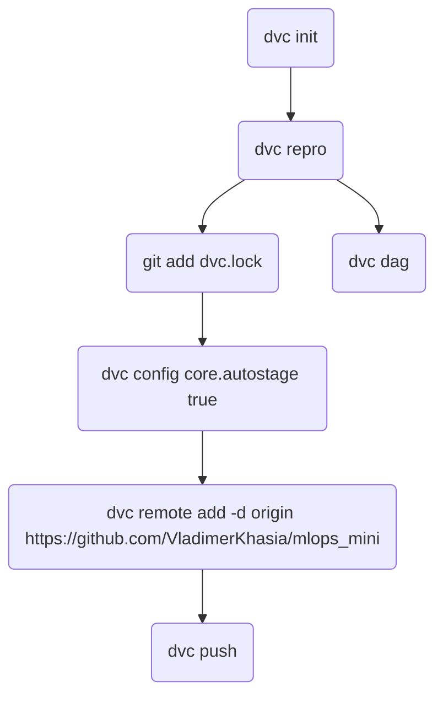

# Small full stack MLOps platform

`langChain` `fastapi` `pydantic` `Data Version Control` `Weights & Biases` `PyTorch` `Generative AI` `gemma-1.1-2b-it` `Hugging Face` `pytest` `docker` `CI/CD github-actions` etc.


### Brief Overview of the Application Integration Section
The smallest GEMMA model, gemma-1.1-2b-it, was fine-tuned for function calling as part of the overall MLOps workflow. It was then integrated into a FastAPI-based mini application to enable functional conversation. The image below illustrates how the developed API operates.


You need to add .env file in the root directory. Example .env file looks like this:
```
HF_TOKEN = 'hfaoejfw8wognwo8ong49gg0ggwlgrmrmlsknlk'
WB_TOKEN = "b2dthfyjj7tykukkkkgui8675656jyjuiy6u66g'

## HF_TOKEN refers to the Hugging Face token, which you get after you create an account on Hugging Face.
## WB_TOKEN refers to Weights & Biases token, which you get after you create an account on Weights & Biases.
```

### Workflow 

     ├── artifact_config.yaml  params.yaml  src/settings.py
     └── src/llm_fc/schemas.py
         └── src/llm_fc/config_manager.py
         |   └── src/llm_fc/components
         |       └── src/llm_fc/pipeline
         |           └── main.py
         |               └── dvc.yaml
         └── src/app


### The compact MLOps platform comprehensively automates the entire process, starting from data acquisition through model integration into applications, culminating in deployment on an Ubuntu VM.

- A step-by-step guide for writting tests, dockerization, setting up a CI/CD pipeline, and deploying on Ubuntu is available in [another repository](https://github.com/VladimerKhasia/fastapi_X). This guide is entirely applicable to the above project; however, you should skip the sections related to databases as they are not used here.
- Here are some more reference materials for [MLOps](https://github.com/VladimerKhasia/ML-in-Notebooks/tree/main/MLOps) and [LangChain integration with Gemma](https://github.com/VladimerKhasia/ML-in-Notebooks/tree/main/custom%20GenAI%20and%20tools).


### Here are some refreshers and a guide for beginners to pay attention to tricky details.

##### ⚡ This is how the `requirements.txt` file was originally populated: `pip freeze > requirements.txt`. You don't need to do this right now unless you're building your own project from scratch. Now, check the `requirements.txt` file and pay attention to the following:

- Packages like PyTorch, torchvision, torchaudio, etc., may have a `+cu118` suffix, which must be commented out to avoid complications on Windows.
- If you're developing an application on one type of platform and want to deploy it on another (e.g., Windows vs. Linux):
  - You can either create separate `requirements.txt` files and use them based on specific logic in your `.github\workflows\main.yml` file (there is code for that commented out in the `main.yml`), or
  - You can make individual packages in your `requirements.txt` conditionally usable for specific platforms. For example, write `pywin32==306; platform_system == 'Windows'` instead of just `pywin32==306`, so that `pywin32` is ignored by non-Windows platforms.
- To install requirements, use: `pip install -r requirements.txt`.
- Also, change `-e some_path/to_local_repo` to `-e .`.
- Instead of `wandb`, you can always use `mlflow`. In that case, use: `pip install mlflow`.
- If you want to create some more text-based documentation: pip install [mkdocs](https://www.mkdocs.org/) or [sphinx](https://www.sphinx-doc.org/) use `sphinx-quickstart`.


##### ⚡ Data Version Control DVC
Diagram shows basic but common steps you may need for data version control:




- `dvc repro` command executes and tracks your pipelines. Instead of directly running python main.py, you use dvc repro, which utilizes your dvc.yaml file. Occasionally, DVC may prompt you to exclude certain directories from Git tracking. Despite adding them to `.gitignore`, they might still be tracked. You can verify this by checking the status. If true, you can remove them using commands like `git rm -r --cached artifacts`.

- After ensuring that undesired files are removed, add the necessary files to Git tracking with `git add dvc.lock dvc.yaml`. These files, once committed and pushed, allow collaborators to access them in the repository. By setting dvc config core.autostage true, Git automatically stages changes made by DVC commands such as `repro`, `add`, or `remove`.

- The `dvc push` command ensures seamless integration with Git and GitHub.

- `dvc dag` provides a visual representation of the dependency graph for stages in one or more pipelines.

- To see which directories and files DVC tracks in the current directory, use `dvc list .`. For a comprehensive list, including subdirectories, append `-R .`. Adding the `--dvc-only` flag at the end, as in `dvc list . --dvc-only`, displays files tracked solely by DVC, excluding those tracked by Git. Adjust your .dvcignore file as needed.

- Be careful with `dvc gc -a --all-branches --all-tags --all-commits` as it removes all cache from DVC. `dvc remove <something>` deletes tracked file metadata and stops tracking it.


##### ⚡ Quick reference to Git and Github:

     - `git init`
     - `git add .`
     - `git commit -m "first commit`
     - `git branch -M main`
     - create empty repository on github mlops_mini
     - `git remote add origin https://github.com/VladimerKhasia/mlops_mini.git`  
     - `git push -u origin main`

     - `git remote set-url origin https://github.com/VladimerKhasia/mlops_mini.git`: Changes the remote repository URL to the specified GitHub repository.
     - `git remote -v`: Verifies the change by displaying the current remote repository URLs.
     - `git push -u origin main`: Pushes the changes to the main branch of the remote repository.


Fastapi changed the way you run your app in dev or in production mode. For dev mode use: `fastapi dev src/app/main.py` 

